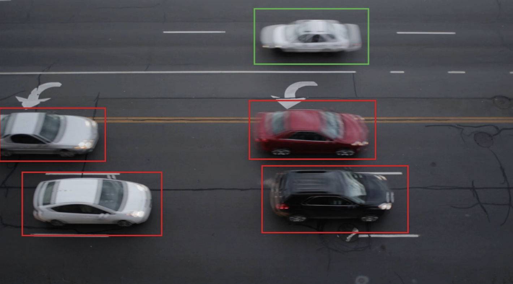

# Traffic Counting
This project features a sophisticated video processing pipeline, developed in C++, that counts the number of cars traveling in both east and west directions through a designated stretch of road. Leveraging the powerful capabilities of OpenCV, the system employs a background subtraction technique to differentiate moving vehicles from the static background. It also utilizes specially designed activation zones within each lane to accurately count vehicles as they cross predefined boundaries.



## Key Features
- **Background Subtraction:** Efficiently identifies moving vehicles against the static backdrop of the road.
- **Activation Zones:** Precisely monitors vehicle crossings through specific lane boundaries to facilitate accurate counting.
- **Directional Traffic Counting:** Independently tracks and counts vehicles moving eastbound and westbound.
- **Visual Identification:** Dynamically draws rectangular bounding boxes around vehicles, color-coded for direction (green for westbound, red for eastbound).
- **Real-time Count Updates:** Continuously updates and displays vehicle counts in the console as vehicles are detected.

## System Requirements
- OpenCV (Ensure that the OpenCV library is properly installed and configured for C++ development)
- CMake (Required for compiling the C++ code)

## Installation and Execution Guide
### Setting Up Your Environment
1. **Install OpenCV:** Ensure that the OpenCV library is installed on your system. Visit the official OpenCV website for installation instructions tailored to your operating system.
2. **Install CMake:** CMake is required to build the project. Download and install CMake from its official website, following the instructions for your operating system.

### Running the Program
1. **Clone the Repository:** Clone or download this project repository to your local machine.
2. **Compile the Program:**
   Navigate to the project directory in your terminal and execute the following commands to build the project:
    ```sh
    cmake .
    make
    ```
3. **Execute the Program:**
   Run the compiled program with the path to the input video file as an argument:
    ```sh
    ./program3 road_traffic.mp4
    ```
